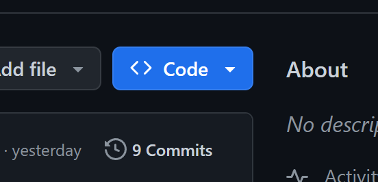
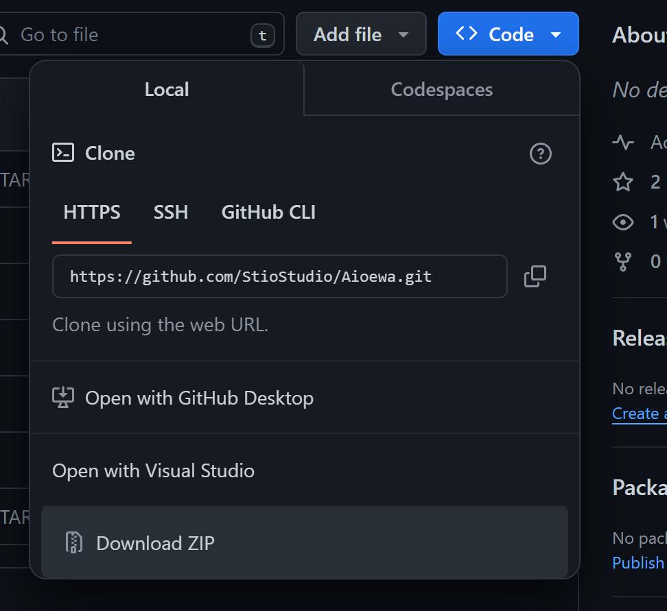
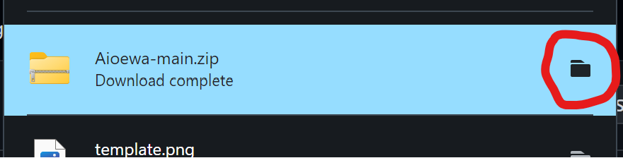
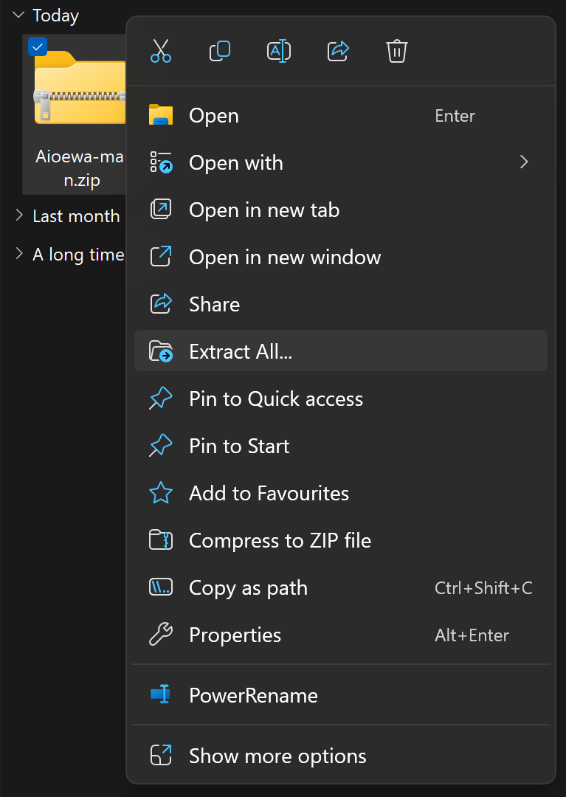
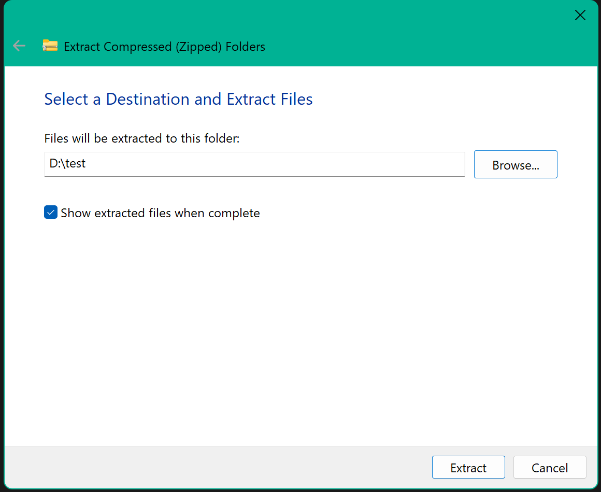
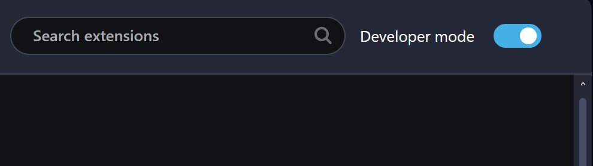
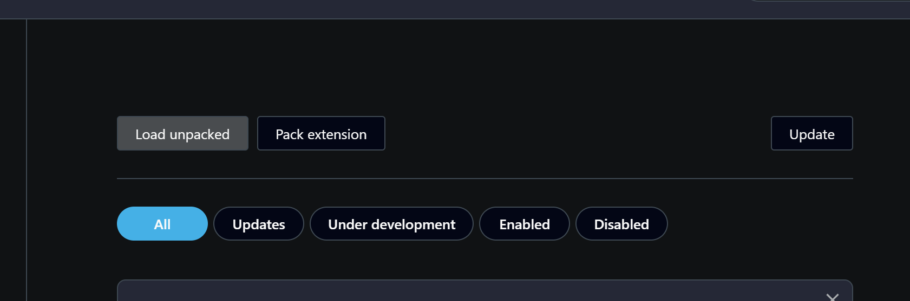
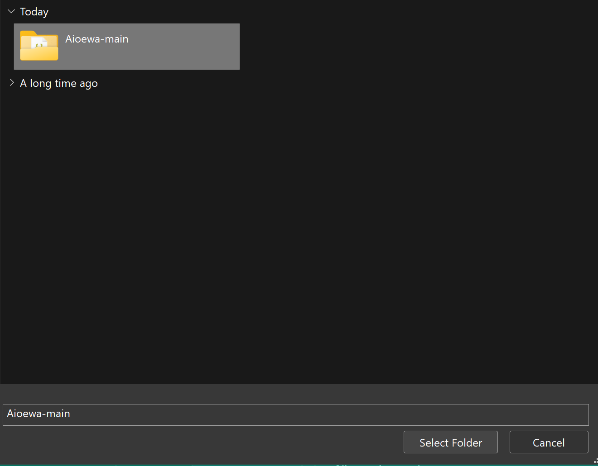

# Aioewa


## Content:
* [What is Aioewa?](#what-is-aioewa)
* [How to install Aioewa](#how-to-install-aioewa)
    * [Get the folder](#get-the-folder)
        * [Git](#git)
        * [Manual download](#manual-download)
    * [Load aioewa in to your browser](#load-aioewa-in-to-your-browser)
        * [Manual load](#manual-load)

## What is Aioewa?
`Aioewa` aka `All in one extension with addons` is an extension that gives you tons of different addons/features that is made by the public. 

## How to install Aioewa
### Get the folder
#### Git
```powershell
git clone https://github.com/StioStudio/Aioewa.git
```
#### Manual download
* Go to https://github.com/StioStudio/Aioewa.
* Click the blue button `code`.

* Click `Download ZIP` to download Aioewa as a zip file.

* Click on the folder icon

* Right click the the ZIP file, then click `Extract-All`.

* Choose where the folder should go by click `Browse...`. Then click `Extract`.


### Load Aioewa in to your browser
#### Manual load
* Go to/past in [chrome://extensions/](chrome://extensions/) in your browser.
* Enable `Developer mode`.

* Click `Load unpacked`.

* Navigate to where you placed the folder.
* Click on `Aioewa-main`, then click `Select-Folder`. 

* You have now Aioewa on your browser 😺